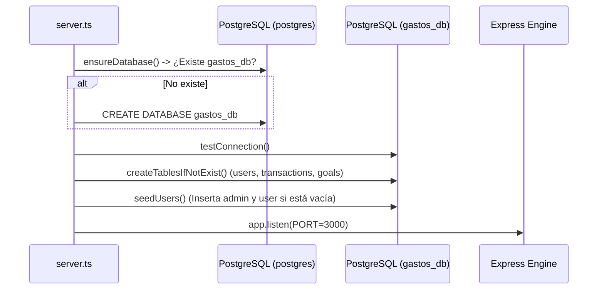
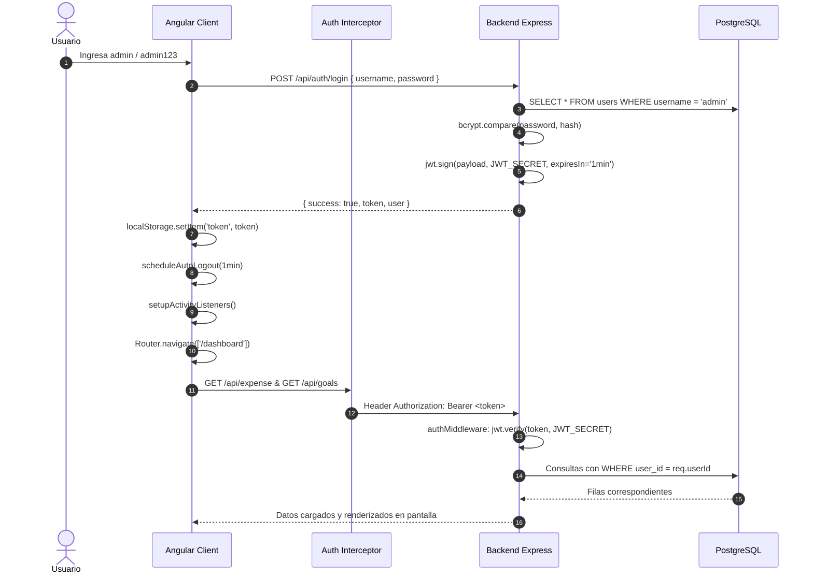
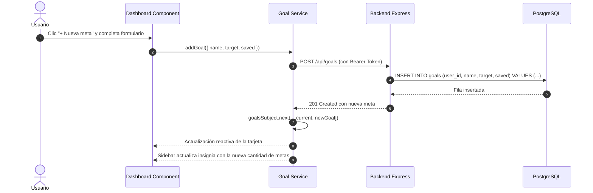

# Control de Gastos — Documentación Técnica de Arquitectura

Sistema integral de gestión y control de finanzas personales diseñado con arquitectura cliente-servidor desacoplada. Este documento detalla exhaustivamente el funcionamiento interno del sistema, su arquitectura por capas, el ciclo de vida de los tokens de autenticación, el modelado de datos y los flujos técnicos que permiten la operación de la plataforma.

---

## Tabla de Contenidos
1. [Visión General del Sistema](#1-visión-general-del-sistema)
2. [Arquitectura por Capas](#2-arquitectura-por-capas)
   - [Capa de Presentación y UI (Angular)](#capa-de-presentación-y-ui-angular)
   - [Capa de Control de Acceso y Red (Guards & Interceptors)](#capa-de-control-de-acceso-y-red-guards--interceptors)
   - [Capa de Estado Reactivo y Servicios (Frontend)](#capa-de-estado-reactivo-y-servicios-frontend)
   - [Capa de Servidor y Rutas HTTP (Express)](#capa-de-servidor-y-rutas-http-express)
   - [Capa de Controladores y Middleware (Backend)](#capa-de-controladores-y-middleware-backend)
   - [Capa de Lógica de Negocio (Backend Services)](#capa-de-lógica-de-negocio-backend-services)
   - [Capa de Persistencia y Base de Datos (PostgreSQL)](#capa-de-persistencia-y-base-de-datos-postgresql)
3. [Mecanismo Técnico de Autenticación y Tokens (JWT)](#3-mecanismo-técnico-de-autenticación-y-tokens-jwt)
   - [Estructura del Token JWT](#estructura-del-token-jwt)
   - [Dónde y cómo se configura el tiempo del token](#dónde-y-cómo-se-configura-el-tiempo-del-token)
   - [Firma y Validación Criptográfica](#firma-y-validación-criptográfica)
   - [Inyección automática de cabeceras (Auth Interceptor)](#inyección-automática-de-cabeceras-auth-interceptor)
   - [Detección de actividad y Renovación Silenciosa](#detección-de-actividad-y-renovación-silenciosa)
   - [Expiración forzada y Cierre de Sesión seguro](#expiración-forzada-y-cierre-de-sesión-seguro)
   - [Hash de contraseñas con Bcrypt](#hash-de-contraseñas-con-bcrypt)
   - [Flujo de Google Identity Services (OAuth2)](#flujo-de-google-identity-services-oauth2)
4. [Módulos del Proyecto y Funcionamiento](#4-módulos-del-proyecto-y-funcionamiento)
   - [Módulo de Autenticación (`/api/auth`)](#módulo-de-autenticación-apiauth)
   - [Módulo de Transacciones (`/api/expense`)](#módulo-de-transacciones-apiexpense)
   - [Módulo de Metas de Ahorro (`/api/goals`)](#módulo-de-metas-de-ahorro-apigoals)
   - [Motor Gráfico de Partículas (HTML5 Canvas)](#motor-gráfico-de-partículas-html5-canvas)
5. [Trazabilidad de Flujos de Ejecución](#5-trazabilidad-de-flujos-de-ejecución)
   - [Flujo de Inicialización del Servidor (Bootstrap)](#flujo-de-inicialización-del-servidor-bootstrap)
   - [Flujo de Inicio de Sesión y Navegación](#flujo-de-inicio-de-sesión-y-navegación)
   - [Flujo de Creación y Abono a Metas de Ahorro](#flujo-de-creación-y-abono-a-metas-de-ahorro)
6. [Modelo de Base de Datos y Esquema Relacional](#6-modelo-de-base-de-datos-y-esquema-relacional)
7. [Variables de Entorno y Puesta en Marcha](#7-variables-de-entorno-y-puesta-en-marcha)

---

## 1. Visión General del Sistema

El proyecto opera bajo el patrón arquitectónico **SPA (Single Page Application)** consumiendo una **API RESTful**:

```
 ┌────────────────────────────────────────────────────────┐
 │                   FRONTEND (Angular 17)                │
 │  Standalone Components  │  Signals  │  RxJS Streams   │
 └───────────────────────────┬────────────────────────────┘
                             │  HTTP / JSON + JWT Bearer
                             ▼
 ┌────────────────────────────────────────────────────────┐
 │                    BACKEND (Node.js + Express)         │
 │  Auth Middleware  │  Controllers  │  Services          │
 └───────────────────────────┬────────────────────────────┘
                             │  pg Pool (SQL Queries)
                             ▼
 ┌────────────────────────────────────────────────────────┐
 │               BASE DE DATOS (PostgreSQL)              │
 │  users  │  transactions  │  goals                      │
 └────────────────────────────────────────────────────────┘
```

- **Frontend:** Construido con Angular 17 utilizando componentes Standalone, inyección moderna (`inject()`), Signals para estados puntuales y `BehaviorSubject` para propagación reactiva de entidades financieras.
- **Backend:** Desarrollado con Node.js, Express y TypeScript, estructurado en arquitectura modular por dominio (`auth`, `expense`, `goal`).
- **Base de Datos:** PostgreSQL con *Connection Pooling* nativo mediante la librería `pg`, auto-creación de base de datos y migración al vuelo.

---

## 2. Arquitectura por Capas

### Capa de Presentación y UI (Angular)
- **Componentes Standalone:** No dependen de `NgModule`. Cada componente declara sus propias dependencias en su metadato `imports`:
  - `LoginComponent`: Captura credenciales, muestra retroalimentación de errores y monta el SDK oficial de Google Sign-In.
  - `DashboardComponent`: Centro de control visual. Consolida transacciones, calcula resúmenes financieros mensuales, renderiza tendencias gráficas en SVG, y administra las metas de ahorro con modales reactivos.
  - `TransactionsComponent`: Tabla interactiva con búsqueda por texto, filtrado por categorías, tipo de movimiento (Gasto/Ingreso) y ordenamiento dinámico por columnas.
  - `SidebarComponent`: Barra lateral de navegación con contador dinámico conectado al servicio de metas.
  - `ParticleCanvasComponent`: Lienzo HTML5 con algoritmo de atracción de partículas y conexiones triangulares según distancia matemática Euclidiana.

### Capa de Control de Acceso y Red (Guards & Interceptors)
1. **`authGuard` (`CanActivateFn`):**
   - Intercepta los cambios de ruta del navegador hacia `/dashboard` o `/transacciones`.
   - Invoca a `authService.isLoggedIn()`.
   - Si no hay token o el token ya expiró en tiempo Unix, aborta la navegación y redirige al usuario a `/login`.
2. **`authInterceptor` (`HttpInterceptorFn`):**
   - Intercepta todas las llamadas HTTP salientes.
   - Lee el token de `localStorage`. Si existe, clona la solicitud e inyecta la cabecera:
     ```http
     Authorization: Bearer <token_jwt>
     ```
   - Si el backend responde con un código **401 Unauthorized** (y la ruta no corresponde a autenticación como `/api/auth/`), detecta de inmediato la invalidación de la sesión, remueve credenciales y redirige al login mostrando mensaje de sesión expirada.

### Capa de Estado Reactivo y Servicios (Frontend)
- **`AuthService`:** Administra el ciclo de vida de la sesión en el cliente, suscripción a eventos de actividad física (mouse, teclado, touch), temporizadores de logout y métodos de login tradicional y Google.
- **`TransactionService`:** Utiliza un `BehaviorSubject<Transaction[]>` que almacena la lista actual de transacciones en memoria. Cuando se agrega, edita o elimina un registro, notifica a todos los componentes suscritos sin necesidad de recargar la página.
- **`GoalService`:** Mantiene sincronizado el estado reactivo de las metas de ahorro entre el `DashboardComponent` y el `SidebarComponent`.

### Capa de Servidor y Rutas HTTP (Express)
- `server.ts`: Inicializa el proceso, asegura la creación de la base de datos, ejecuta la creación de tablas e inicia el listener en el puerto configurado (`PORT=3000`).
- `app.ts`: Configura middlewares globales de Express:
  - `cors()`: Permite la comunicación segura de orígenes cruzados con el frontend (`http://localhost:4200`).
  - `express.json()` y `express.urlencoded()`: Parsean cuerpos de peticiones JSON y formularios.
  - Enrutadores por prefijo: `/api/auth`, `/api/expense` y `/api/goals`.

### Capa de Controladores y Middleware (Backend)
- **`authMiddleware`:**
  - Extrae el encabezado `Authorization`.
  - Verifica la firma criptográfica del token usando la clave maestra `JWT_SECRET`.
  - Si es válido, extrae el identificador del usuario (`userId`), nombre de usuario (`username`) y su rol (`role`), inyectándolos directamente en la solicitud de Express (`req.userId`).
  - Si el token está ausente, expiró o su firma fue adulterada, frena el procesamiento con código `401 Unauthorized`.
- **`adminOnly`:**
  - Verifica si `req.role === 'ADMIN'`. Si no lo es, responde con `403 Forbidden`.

### Capa de Lógica de Negocio (Backend Services)
- `AuthService`: Orquesta la búsqueda de usuarios, comparación de contraseñas hasheadas mediante `bcrypt.compare`, validación de tokens de Google vía `OAuth2Client` y firma de nuevos JWTs.

### Capa de Persistencia y Base de Datos (PostgreSQL)
- Conexión basada en `Pool` de `pg`, reutilizando clientes abiertos para optimizar la latencia.
- Configuración de parser OID (`types.setTypeParser(1082)`) para evitar que PostgreSQL altere fechas `DATE` por desfasajes de huso horario al serializarlas en formato ISO UTC.

---

## 3. Mecanismo Técnico de Autenticación y Tokens (JWT)

### Estructura del Token JWT
El sistema genera tokens estándar basados en RFC 7519 compuestos por tres partes separadas por puntos:

```
eyJhbGciOiJIUzI1NiIsInR5cCI6IkpXVCJ9.eyJpZCI6MSwidXNlcm5hbWUiOiJhZG1pbiIsInJvbGUiOiJBRE1JTiIsImlhdCI6MTc4ODQ2NTA1NCwiZXhwIjoxNzg4NDY1MTE0fQ.signature
```

1. **Header:** Especifica el algoritmo (`HS256`) y el tipo de token (`JWT`).
2. **Payload:** Contiene las afirmaciones (*claims*) del usuario:
   ```json
   {
     "id": 1,
     "username": "admin",
     "role": "ADMIN",
     "iat": 1788465054,
     "exp": 1788465114
   }
   ```
   - `id`: Llave primaria del usuario en la tabla `users`.
   - `username`: Nombre de usuario.
   - `role`: Rol asignado (`ADMIN` o `USER`).
   - `iat` (*Issued At*): Timestamp Unix en segundos de cuándo fue generado.
   - `exp` (*Expiration Time*): Timestamp Unix en segundos de cuándo caduca.
3. **Signature:** Hash HMAC-SHA256 calculado combinando el Header codificado en Base64, el Payload en Base64 y el secreto privado del servidor (`JWT_SECRET`).

---

### Dónde y cómo se configura el tiempo del token

El tiempo del token se controla **exclusivamente** desde el archivo:

📂 **[`backend/src/modules/auth/services/auth.service.ts`](file:///c:/Users/gahel/Desktop/ControlGastos/backend/src/modules/auth/services/auth.service.ts)**

En la constante exportada:

```typescript
export const JWT_EXPIRES_IN = '1min';
```

#### ¿Qué valores puedes colocar?
La librería `jsonwebtoken` procesa internamente cadenas de texto gracias al parser de tiempo `ms`:
- Minutos: `'1min'`, `'1m'`, `'5m'`, `'15m'`
- Horas: `'1h'`, `'8h'`, `'24h'`
- Segundos o días: `'30s'`, `'7d'`

Tanto el inicio de sesión regular, el inicio de sesión con Google y la ruta de refresco (`/api/auth/refresh`) leen exactamente esta misma variable.

---

### Firma y Validación Criptográfica
- **Al iniciar sesión:** El backend ejecuta:
  ```typescript
  jwt.sign({ id: user.id, username: user.username, role: user.role }, JWT_SECRET, { expiresIn: JWT_EXPIRES_IN })
  ```
- **Al recibir peticiones:** En [`auth.middleware.ts`](file:///c:/Users/gahel/Desktop/ControlGastos/backend/src/middlewares/auth.middleware.ts), el middleware ejecuta:
  ```typescript
  const decoded = jwt.verify(token, JWT_SECRET);
  ```
  Si el token expiró, `jwt.verify` lanza `TokenExpiredError`. Si el secreto no coincide o el token fue manipulado, lanza `JsonWebTokenError`. Ambos son capturados y devuelven `401`.

---

### Inyección automática de cabeceras (Auth Interceptor)
En Angular, [`auth.interceptor.ts`](file:///c:/Users/gahel/Desktop/ControlGastos/frontend/src/app/interceptors/auth.interceptor.ts) asegura que el cliente no tenga que adjuntar manualmente el token en cada llamada:

```typescript
export const authInterceptor: HttpInterceptorFn = (req, next) => {
  const token = localStorage.getItem('token');
  const authReq = token ? req.clone({ setHeaders: { Authorization: `Bearer ${token}` } }) : req;
  return next(authReq).pipe(
    catchError((error) => {
      if (error.status === 401 && !req.url.includes('/api/auth/')) {
        authService.onSessionExpired();
      }
      return throwError(() => error);
    })
  );
};
```

---

### Detección de actividad y Renovación Silenciosa
Para ofrecer una experiencia de usuario fluida sin desconexiones inesperadas mientras el usuario está trabajando:

1. El frontend escucha eventos nativos del navegador fuera de la zona Angular (`runOutsideAngular`) para no degradar el rendimiento:
   `mousemove`, `mousedown`, `keydown`, `touchstart`, `scroll`, `click`.
2. Al ocurrir actividad, se ejecuta `recordActivity()` (con aceleración máxima de 1 revisión cada 5 segundos).
3. **Cálculo de renovación dinámico:**
   El frontend lee el `iat` y `exp` decodificando el Base64 del token:
   $$\text{totalDuration} = (\text{exp} - \text{iat}) \times 1000 \text{ ms}$$
   $$\text{refreshThreshold} = \min(240000 \text{ ms}, \text{totalDuration} \times 0.25)$$
   - Si la meta dura **1 minuto (60,000 ms)**, el umbral es **15 segundos**. Durante los primeros 45 segundos no se envían peticiones innecesarias. Cuando faltan menos de 15 segundos y el usuario está interactuando, se solicita silenciosamente un nuevo token a `POST /api/auth/refresh`.
   - Si la sesión dura **8 horas**, el umbral se acota a los últimos **4 minutos**.

---

### Expiración forzada y Cierre de Sesión seguro
Si el usuario abandona la computadora y no realiza ninguna acción:
1. Al momento de recibir el token, se registra un temporizador:
   $$\text{msUntilExpiration} = \text{exp} - \text{Date.now()}$$
2. Un `setTimeout` programa la ejecución de:
   ```typescript
   this.logout('Sesión expirada');
   this.router.navigate(['/login']);
   ```
3. El `localStorage` se limpia de inmediato (`removeItem('token')`, `removeItem('user')`).

---

### Hash de contraseñas con Bcrypt
Las contraseñas no se almacenan jamás en texto legible. Al crear usuarios o sembrar credenciales por defecto:
```typescript
const hash = await bcrypt.hash(password, 10);
```
Se calculan **10 rondas de salado criptográfico**, garantizando protección contra ataques de diccionario y tablas *rainbow*.

---

### Flujo de Google Identity Services (OAuth2)
1. El frontend carga la librería oficial `https://accounts.google.com/gsi/client`.
2. Al autenticar la cuenta de Google, Google entrega un **ID Token (JWT firmado por Google)**.
3. El frontend envía dicho token a `POST /api/auth/google`.
4. El backend verifica la autenticidad del token con los servidores de Google mediante `google-auth-library`:
   ```typescript
   const ticket = await googleClient.verifyIdToken({ idToken: credential, audience: GOOGLE_CLIENT_ID });
   ```
5. Si el correo está verificado, busca al usuario en la BD; si no existe, lo crea automáticamente generando un nombre de usuario único y emite un JWT de sesión del sistema.

---

## 4. Módulos del Proyecto y Funcionamiento

### Módulo de Autenticación (`/api/auth`)
| Ruta | Verbo | Función Técnica |
| :--- | :--- | :--- |
| `/login` | `POST` | Compara username/email y contraseña con Bcrypt; retorna token y datos de usuario. |
| `/google` | `POST` | Valida credencial de Google OAuth2 y realiza upsert en tabla `users`. |
| `/google/client-id` | `GET` | Expone de forma segura el Client ID público configurado. |
| `/refresh` | `POST` | Emite un token fresco con tiempo renovado para el usuario autenticado. |

---

### Módulo de Transacciones (`/api/expense`)
Permite la administración de flujos de dinero:
- **Campos:** `description`, `category`, `type` (`Gasto` / `Ingreso`), `amount` (mayor a 0) y `date` (`YYYY-MM-DD`).
- **Seguridad por usuario:** Cada consulta SQL inyecta obligatoriamente `WHERE user_id = $1` extraído de la firma del token del solicitante, imposibilitando que un usuario acceda a finanzas de otro.
- **Cálculo de métricas en Frontend:**
  - El frontend agrupa transacciones del mes actual y del mes anterior en estructuras `Map`.
  - Genera las coordenadas de gráficos SVG y los radios de las burbujas proporcionales al gasto por categoría.

---

### Módulo de Metas de Ahorro (`/api/goals`)
Sistema reactivo y persistente para planificación de metas financieras:
- **Base de Datos:** Almacenado en la tabla `goals`.
- **Endpoints:**
  - `GET /api/goals`: Lista todas las metas del usuario. Si es un usuario nuevo sin registros, inserta automáticamente 3 metas de ejemplo para guiarlo.
  - `POST /api/goals`: Registra una nueva meta validando nombre, monto objetivo (> 0) y ahorro inicial.
  - `PUT /api/goals/:id`: Permite modificar los datos de una meta existente.
  - `POST /api/goals/:id/contribute`: Abono directo. Ejecuta `UPDATE goals SET saved = saved + $1` de forma atómica en SQL.
  - `DELETE /api/goals/:id`: Elimina la meta correspondiente.
- **Interfaz Interactiva:**
  - Modal integrado para creación de nuevas metas.
  - Modal con accesos directos (*chips* `+Q100`, `+Q500`, `+Q1000`, `Completar`) para abonar dinero con un solo clic.
  - Distintivo visual con cálculo en tiempo real de porcentaje y etiquetas de estado (`Faltan Q...` o `Completada 🎉`).
  - Insignia numérica en la barra lateral (*Sidebar*) conectada al flujo reactivo `GoalService`.

---

### Motor Gráfico de Partículas (HTML5 Canvas)
Ubicado en `frontend/src/app/shared/components/particle-canvas`:
- Inicializa un `<canvas>` ajustado a la resolución de pantalla mediante `devicePixelRatio`.
- Genera un arreglo de vectores con posición `(x, y)` y velocidades aleatorias `(vx, vy)`.
- En cada ciclo `requestAnimationFrame`:
  - Actualiza la posición de las partículas y rebota contra los límites del viewport.
  - Calcula la distancia Euclidiana $d = \sqrt{(x_2-x_1)^2 + (y_2-y_1)^2}$.
  - Si la distancia es menor a un umbral (ej. 140px), dibuja una línea con opacidad inversamente proporcional a la distancia, generando un efecto de constelación interactiva de alto rendimiento.

---

## 5. Trazabilidad de Flujos de Ejecución

### Flujo de Inicialización del Servidor (Bootstrap)


---

### Flujo de Inicio de Sesión y Navegación


---

### Flujo de Creación y Abono a Metas de Ahorro


---

## 6. Modelo de Base de Datos y Esquema Relacional

```sql
-- Tabla: users
CREATE TABLE IF NOT EXISTS users (
  id SERIAL PRIMARY KEY,
  username VARCHAR(100) NOT NULL UNIQUE,
  password VARCHAR(255),
  email VARCHAR(100) UNIQUE,
  role VARCHAR(10) NOT NULL DEFAULT 'USER' CHECK (role IN ('ADMIN', 'USER')),
  google_id VARCHAR(255),
  picture VARCHAR(500),
  createdAt TIMESTAMP DEFAULT CURRENT_TIMESTAMP
);

-- Tabla: transactions
CREATE TABLE IF NOT EXISTS transactions (
  id SERIAL PRIMARY KEY,
  user_id INTEGER REFERENCES users(id) ON DELETE CASCADE,
  description VARCHAR(255) NOT NULL,
  category VARCHAR(100) NOT NULL,
  type VARCHAR(20) NOT NULL CHECK (type IN ('Gasto', 'Ingreso')),
  amount DECIMAL(12, 2) NOT NULL CHECK (amount > 0),
  date DATE NOT NULL,
  created_at TIMESTAMP DEFAULT CURRENT_TIMESTAMP
);

-- Tabla: goals (Metas de ahorro)
CREATE TABLE IF NOT EXISTS goals (
  id SERIAL PRIMARY KEY,
  user_id INTEGER REFERENCES users(id) ON DELETE CASCADE,
  name VARCHAR(150) NOT NULL,
  target DECIMAL(12, 2) NOT NULL CHECK (target > 0),
  saved DECIMAL(12, 2) NOT NULL DEFAULT 0 CHECK (saved >= 0),
  created_at TIMESTAMP DEFAULT CURRENT_TIMESTAMP
);
```

### Llaves e Integridad Referencial
- `ON DELETE CASCADE`: Si se elimina un usuario, automáticamente se purgan sus transacciones y sus metas asociadas para mantener la base de datos limpia de registros huérfanos.
- `CHECK constraints`: Validan en el propio motor de la base de datos que los tipos sean válidos y los montos monetarios sean estrictamente positivos.

---

## 7. Variables de Entorno y Puesta en Marcha

Archivo `backend/.env`:

```env
# Conexión a PostgreSQL
DB_HOST=localhost
DB_PORT=5432
DB_USER=postgres
DB_PASSWORD=tu_password_postgres
DB_NAME=gastos_db

# Puerto del servidor
PORT=3000

# Clave secreta para firma y verificación de JWT
JWT_SECRET=mi_secreto_super_seguro_cambiar_en_produccion

# Google OAuth Client ID (Opcional para login con Google)
GOOGLE_CLIENT_ID=
```

### Comandos de Ejecución

```bash
# Terminal 1 - Iniciar Backend
cd backend
pnpm install
pnpm run dev
# Servidor listo en: http://localhost:3000

# Terminal 2 - Iniciar Frontend
cd frontend
pnpm install
pnpm run start
# Aplicación web lista en: http://localhost:4200
```

### Usuarios Predeterminados Sembrados
Si la base de datos está vacía, se inicializan automáticamente:

| Usuario | Contraseña | Rol | Correo |
| :--- | :--- | :--- | :--- |
| `admin` | `admin123` | `ADMIN` | `admin@gastos.com` |
| `user` | `user123` | `USER` | `user@gastos.com` |
